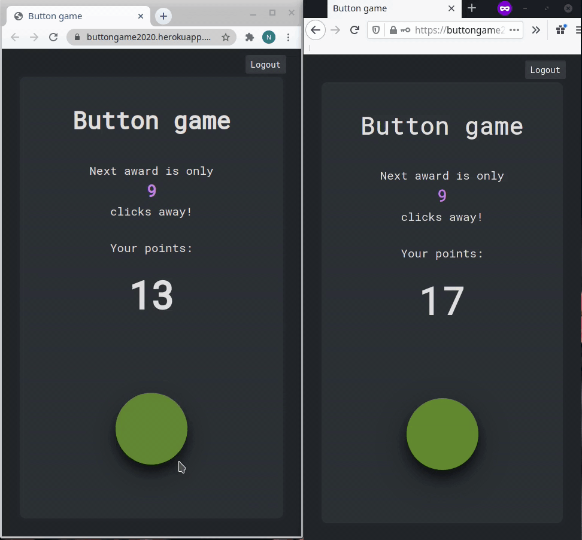

# Button game

A simple multipalyer game where players earn points by clicking the game button.

Try it here: https://buttongame2020.herokuapp.com/

<br/>



## Game logic

Each player gets 20 points on registration. The goal is to click the game button to earn more points.

Each click costs one point. All the players increase the amount of clicks in the same counter.

More points can be earned by the following rules:

- 5 points on every 10th
- 40 points on every 100th
- 250 points on every 500th game button click in the game.

The total amount of clicks in the counter is not shown to the players. They only see their score and the amount of clicks to the next possibility to earn points. Players are notified when they win points.

The players have the possibility to restart the game with 20 points in case their points fall to 0.

## Project structure

The project consists of a backend and a frontend.

The bacend is made with Node.js and Express. MongoDB is used as the database where the user info and game button clicks are saved. The backend runs on Heroku at the moment.

The frontend is made with React and Redux. The state of the Redux store is saved in the browser's local storage. This makes the user stay logged in automatically even on page refresh or browser reopening. The local storage is emptied only after logout.

Communication between the backend and the frontend is implemented with Axios and Socket.io.

The project is structured so that the root folder has *server.js* file where the Express app lives. *Router.js* file takes care of the routing. The folder *models* holds the models that tell how the data is stored to MongoDB. The files of the React app are in the *frontend* folder. The folder *build* is a built version of the frontend which is in Heroku.

## Getting started

You must have Node.js installed on your computer. If you don't have it yet, check here: https://nodejs.org/en/download/

When you have it, clone this repository:
```
git clone https://github.com/nellileinonen/button-game.git
```
Go to the newly created button-game folder:
```
cd button-game
```
Go to the frontend folder where you can find the code that is relevant to the React app:
```
cd frontend
```
Install dependencies by typing:
```
npm install
```
Then run:
```
npm start
```
After this, the game should be up and running in development mode!
